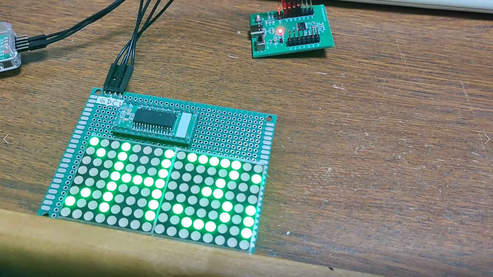
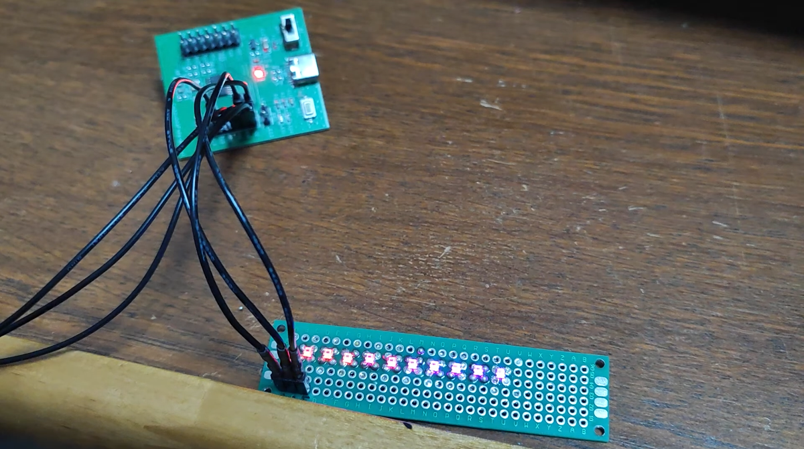
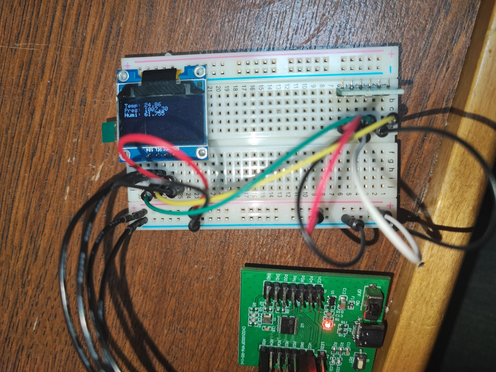
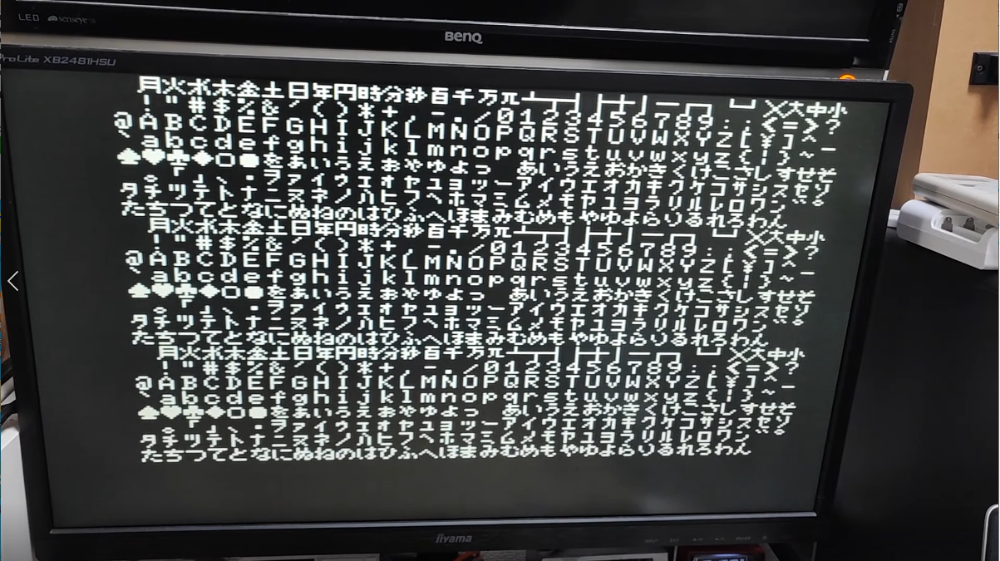
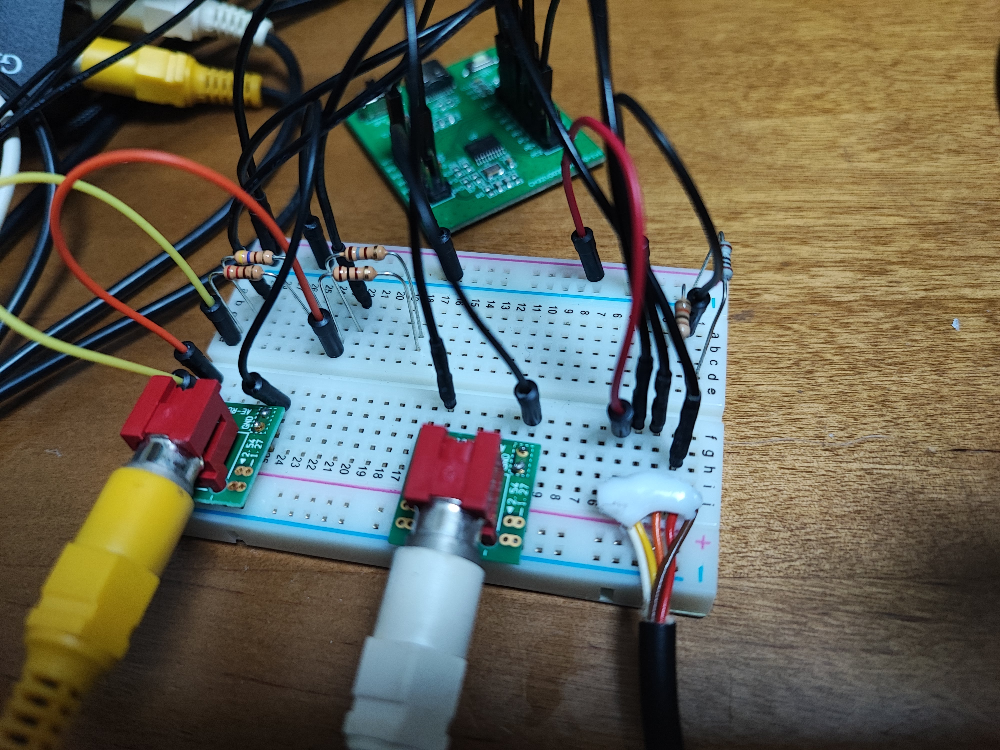
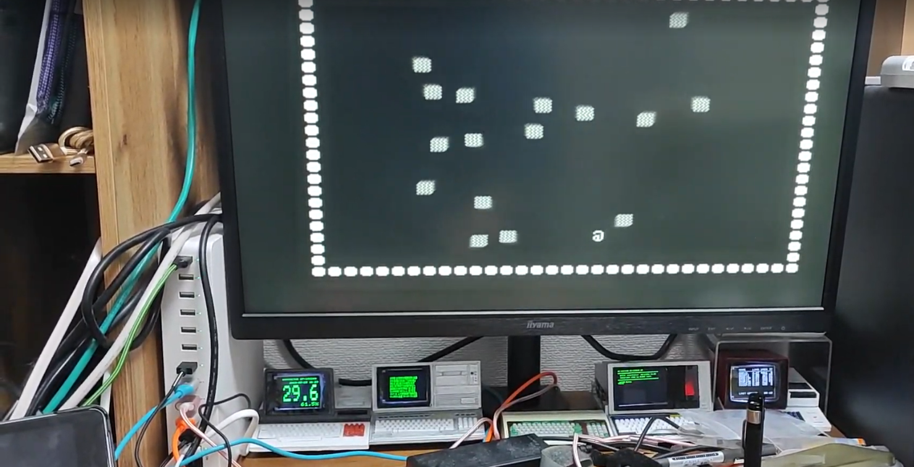
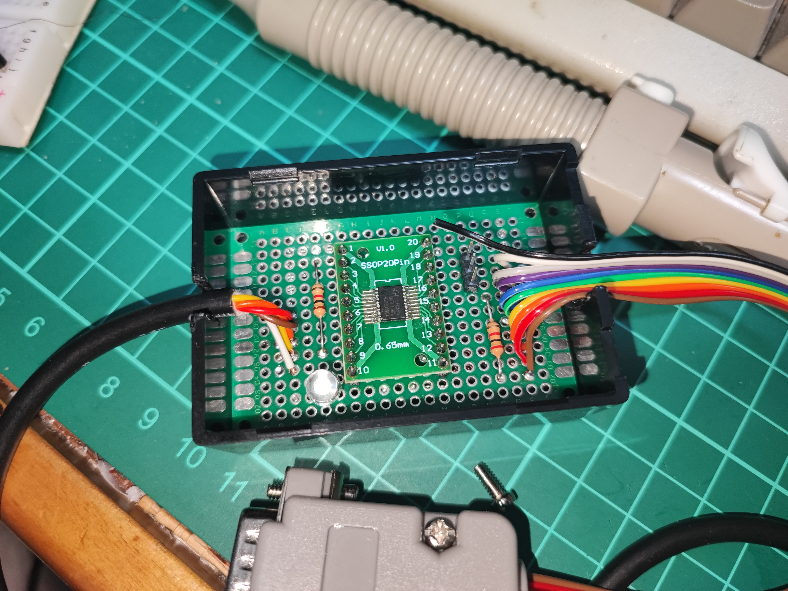

# My CH32V003 example programs on MounRiverStudio

- TM1640 - TM1640 matrix LED test
- Neopixel - Neopixel LED strip test
- I2Ctest - BMP280 enviromnt sensor and SSD1306 OLED display test
- tone / tone2 - Beep test
- Polytone - Polyphonic beep test with PWM
- SleepTest - Standby(stop) Mode and external wakeup test 
- tvout - NTSC video output test
- tvgame - Simple game demo
- snes2atari - SNES pad ATARI joystick converter

Create new project on MRS. Copy files into your project's User folder.<br>
"glcdfont.h" is a file from Adafruit_GFX Library. <br>

---

# CH32V003 テストプログラム集

MounRiverStudio で新規 CH32V003 プロジェクトを作成の上、これらのファイルを User フォルダ中にコピーしてください。<br>

- TM1640



TM1640 を使った、LEDマトリックス制御。普通にGPIOを制御してるだけ。<br>
PD2 を TM1640 の CLK に、PD3 を DATA に接続<br>

- Neopixel



Neopixel LEDストリップの制御。SPI を 6MHz に設定して、Neopixel 1 bit= SPI 1 byte で送っている。<br>
PC6 を Neopixel の DIN に接続<br>

- I2Ctest




I2C で BMP280 センサーと SSD1306 OLED を制御。<br>
BMP280 は 0x76、OLED は 0x3c にある前提。STM32と同じく、プログラム中では I2C の指定アドレスが*2倍*なので注意<br>
PC1を SDA、PC2 を SCK に接続<br>
 
- tone/tone2

圧電ブザーなどをならす、Arduino でいうところの tone() もどき。<br>
PWM の周波数＝発声周波数としている<br>
PD2 と GND をブザーなどに接続<br>
PD2 でうじゃうじゃやってると、PD1を使ってる書き込みができないことがあるので注意<br>

- Polytone

圧電ブザーをならす続き<br>
PWM は 200kHz くらい(=SystemCoreClock/256)に設定<br>
48kHz で systick 割り込みを発生させて、矩形波3音(可変)を合成した値を PWM の値に設定してる<br>
昔入力したドラクエ2/3の楽曲データからコンバートしたのだが、元データがいろいろと間違ってた…<br>

- SleepTest

Sleep mode (STM32 でいうところの stop モード)に入って、EXT割り込みで復帰するテスト<br>
PD0を LOW に落とすと、PD2 のブザーから昔のPCでおなじみのピポ音を発生させる<br>
データシートだと sleep モードは数uA くらいなのに、50uA くらい喰ってるのでなにか間違ってるかも？<br>
これも Sleep mode 時は PD1 を受け付けないので、書き込み不可になるので注意<br>

- tvout



NTSC のモノクローム・コンポジットビデオ信号(もどき)を発生させるデモ<br>
PC4 と PC6 から適当な抵抗を挟んでビデオ信号に接続(下記は Vcc=3.3V の場合)<br>

```
 PC4 -- R1 --+
 PC6 -- R2 --+---> Video

 R1: 470 + 220 ohm
 R2: 180 + 100 ohm
```

等化パルスなどは手抜きのため省略。よってインターレースはこのままでは出せない<br>
外部クロック(48MHz HSE)で動かすこと。内部クロックでは画面がふらつく<br>
テキストVRAM で 32*24 文字が表示可能。
画面サイズは変更可能だが、合計1500文字くらいで VRAM が確保できなくなるので注意<br>
フォントは MSX のフォントを拝借<br>

- tvgame





tvout と tone を組み合わせた、テレビゲームっぽいデモ<br>
tvout はスプライトもどき機能を追加<br>
スーファミコントローラを入力に使用<br>
スーファミコントローラの Data 入力が、なぜか浮くので 10k Ω抵抗でプルダウンしないと読めなかった<br>

- snes2atari



スーファミコントローラを Atari 仕様ジョイスティック信号に変換する変換器。<br>
電源はジョイスティックの 5V を使用する。
3.3V では不安定だったが 5V で駆動すればちゃんと信号は読めるようだ。<br>

```
to ATARI Joystick
 PC0 -- UP
 PC1 -- DOWN
 PC2 -- LEFT
 PC3 -- RIGHT
 PC4 -- Trigger A
 PC5 -- Trigger B
 VCC -- VCC
 GND -- GND

to SNES Pad
 PD2 -- LATCH
 PD3 -- CLK
 PD4 -- DATA
 VCC -- VCC
 GND -- GND
```


## Note: CH32V003 の動作クロックについて

MRSの生成コードは (現状では Arduinoも) EVT 開発ボード向けに作られており、デフォルトの設定は「外部クロック2倍48MHz」になっています。
STM32系の MCU では、電源ONやリセットの時点では「内部クロック」で動作しており、スタートアップのコードでクロックを切り替えるようになっています。
切り替え先のクロックが準備できないときは、クロックの変更に失敗してそのまま内部クロックで動作し続けます。<br>

CH32V003で外部クロック設定のまま外部クロックを接続しないと、切り替え先のクロックが準備できていないので、そのまま内部24MHz で動作し続けます。
このとき、SystemCoreClock変数は 48MHz のままなので、クロックに依存する機能が設定とずれて動作します。
(例えばDelay_Msが2倍の時間がかかるとか)<br>

動作クロックを変更するには system_ch32v00x.c の以下の場所を書き換えます<br>

```
/* 
* Uncomment the line corresponding to the desired System clock (SYSCLK) frequency (after 
* reset the HSI is used as SYSCLK source).
* If none of the define below is enabled, the HSI is used as System clock source. 
*/

//#define SYSCLK_FREQ_8MHz_HSI    8000000
//#define SYSCLK_FREQ_24MHZ_HSI   HSI_VALUE
//#define SYSCLK_FREQ_48MHZ_HSI   48000000
//#define SYSCLK_FREQ_8MHz_HSE    8000000
//#define SYSCLK_FREQ_24MHz_HSE   HSE_VALUE
#define SYSCLK_FREQ_48MHz_HSE   48000000

```

SYSCLK_FREQ_48MHz_HSE から、SYSCLK_FREQ_48MHZ_HSIに変えると、内部クロック2倍48MHz 設定に変更されます。

そもそも、外部クロック設定のままにすると PA1/PA2 が使えないので、もったいないですね。


## Note: CH32V003 のブートローダについて

CH32V003は boot0 ピンが存在しない代わりに、FLASH_STATR レジスタの bit14 を見て、BootLoader 領域か User 領域のどちらから起動するかを決めている<br>
(Reference マニュアルには FLASH_OBTKEYR と誤記されている)<br>

電源オン時には、かならず BootLoader から起動し、BootLoaderから明示的に UserMode を指定してリセット NVIC_SystemReset() しないと、
Userのコードに制御が渡らない<br>

NRST ピンでリセットかけても、このレジスタの状態は書き換わらないので、UserMode から BootLoader を起動するには、電源を入れなおすか、
明示的に bootMode を指定してリセットをする<br>

マニュアルの挙動と違うようなので注意<br>